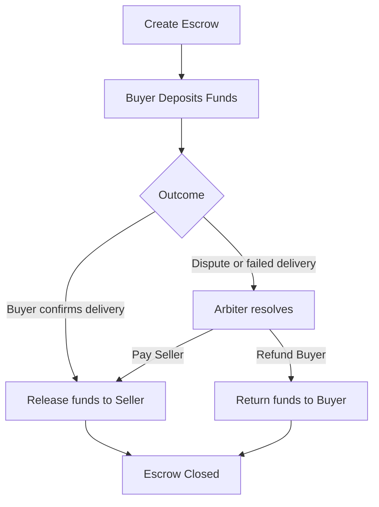

# Solidity Escrow Smart Contract

This repository contains a minimal Solidity escrow contract for a buyer, seller, and arbiter flow.

## Story Arc Diagram

## Contract

The escrow contract is located at:

- `contracts/Escrow.sol`
